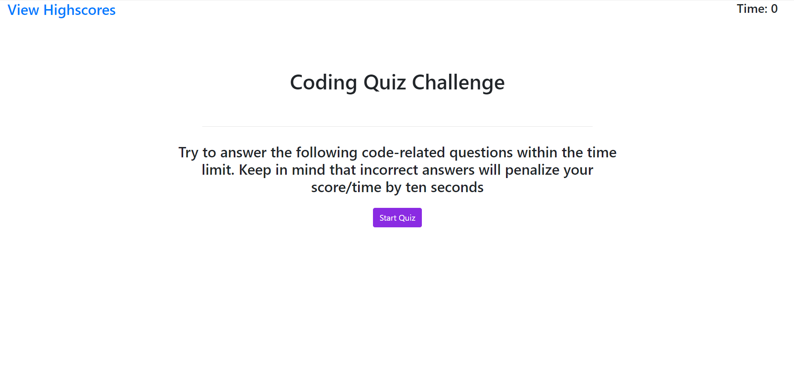
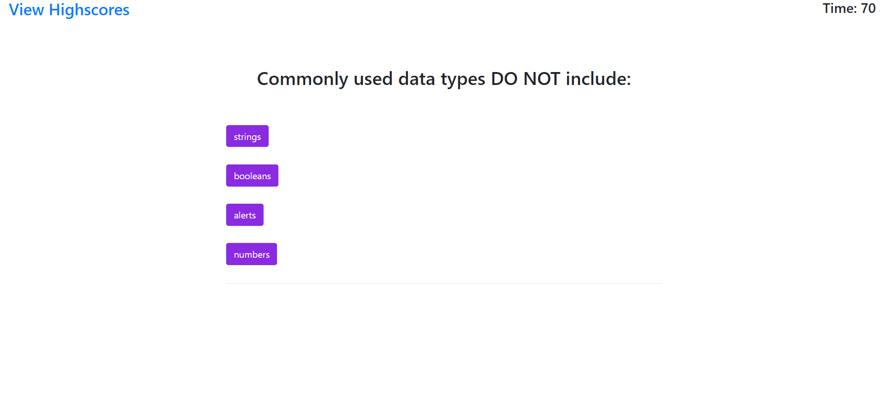
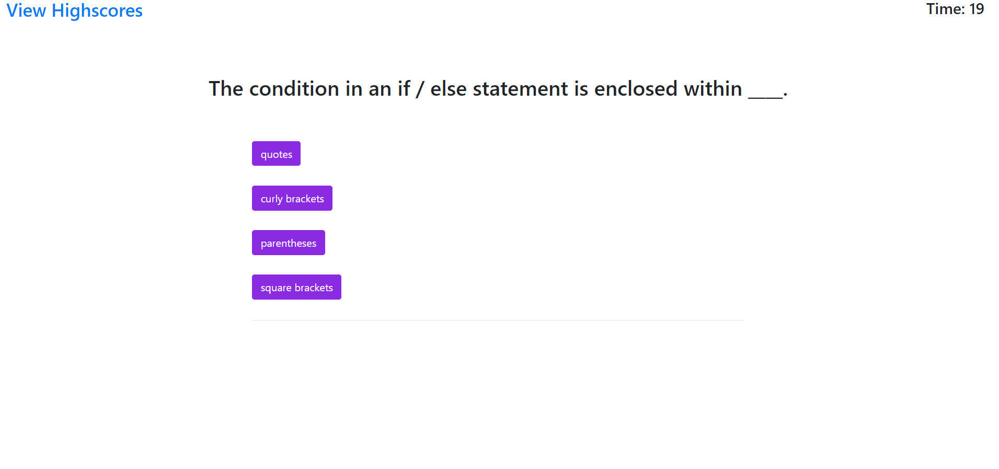
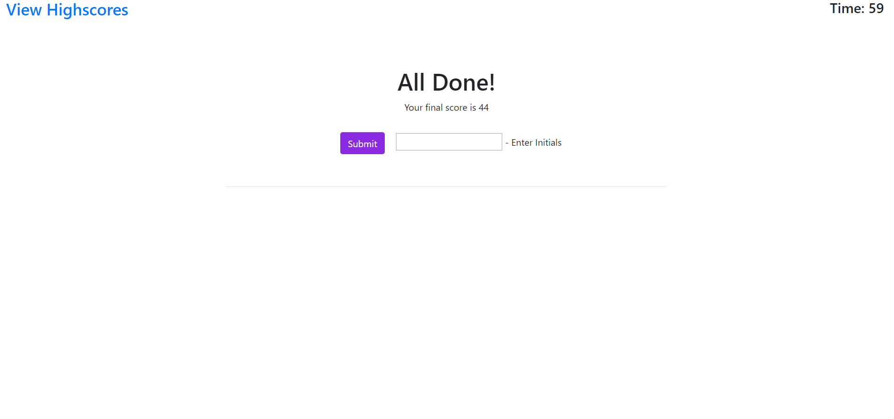
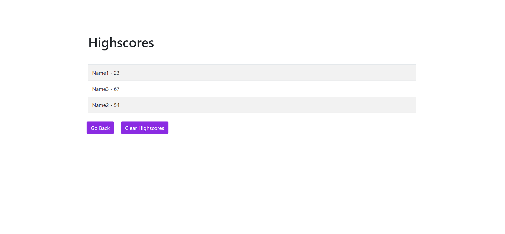

# Coding Quiz

Clicking "Start Quiz" button will start the timer, hide initial page content, and replace it with a dynamically generated question as well as answer buttons.

Correct answers add to the user's score

Wrong answers remove time from the timer

The end of the quiz will generate an end screen where user can submit their initials along with their score from the quiz.

Clicking the link to view highscores will bring user to a table of locally stored highscores.

## Screenshot

   
   
   
   
   

### Links

[Github Repo](https://github.com/Coollin162/Coding-Quiz-Challenge)

[Completed Work](https://coollin162.github.io/Coding-Quiz-Challenge/)
